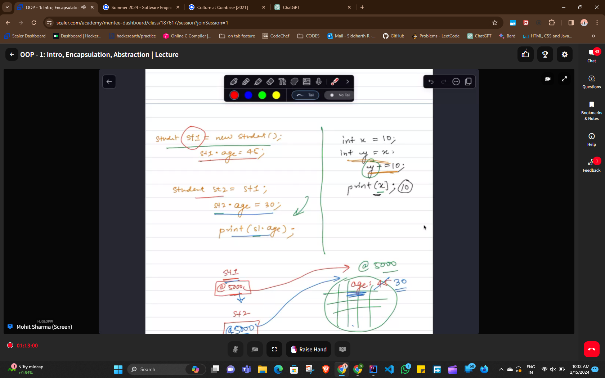
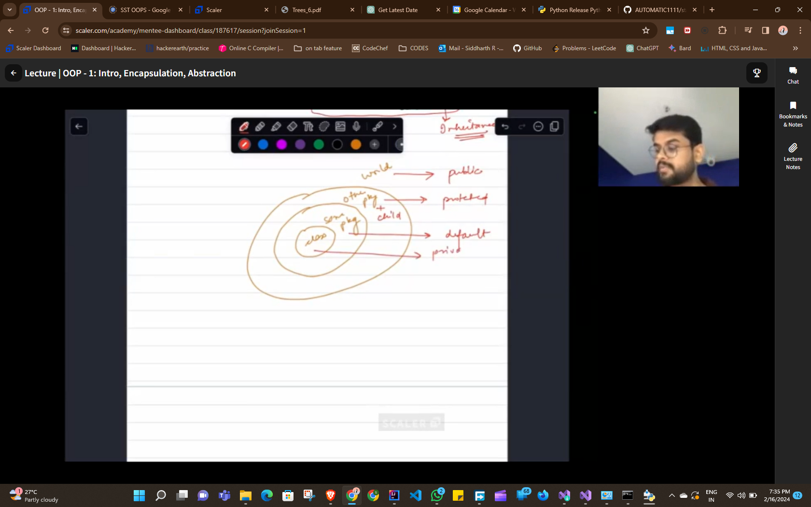

# OOPS
### Abstration and Encapsulation
###### Intro
It's like a set of rules to be follwed
To supprot abstration there are three pillars ,encapsulation  , Inheritance , Polymorphism

Abstaration  - Hiding unnecessaary infos

Encapsulation - (capsule - wraps our medicine together ,and protect it)
similarly 'class' wraps all the info

###### Entity 
Entity is considered a whole packet which contains many addresses towards 
,attribution  , behaviour

attributes - features of entity

behaviour   - is what/(entity) is capable of doing

> Reference variable - allocated a memoryh at 200435,it is  similar to home address
> 

Capenter - painter -house - duplicate keys example

### Access Modiifiers

- *Public*  - anyone can access it anywhere
- *private* - only accesble within a class
- *default*  - ""  " "              a package
- *protected*  -only acc within a package , but can be accessed outside via child class

private>default>protected>public(security order)

